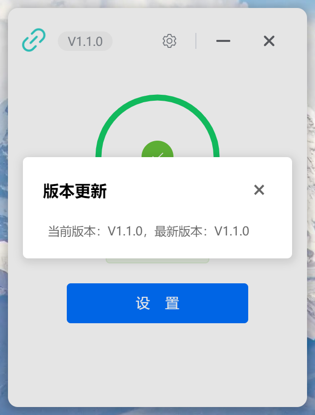

  

# 科大校园网小助手

*✨ 解决校园网登录联网问题，增加实用功能，开箱即用 ✨*

  
  
  
  
  

## 功能

1. 自动登录校园网:
   + [x] `账号密码保存在本地，不会上传到服务器`
2. 自动断线重连
3. 自动检测更新
   + [x] `支持自动更新`
   + [x] `支持手动更新`
4. 自动检测网络状态

## 演示

### 截图展示

## 注意

本项目使用 MIT 协议进行开源，在此基础上，必须在页面底部保留署名以及指向本项目的链接。如果不想保留署名，必须首先获得授权。

同样适用于基于本项目的二开项目。

依据 MIT 协议，使用者需自行承担使用本项目的风险与责任，本开源项目开发者与此无关。

## Star History

<a href="https://star-history.com/#Ackites/hnust-cna&Date">
  <picture>
    <source media="(prefers-color-scheme: dark)" srcset="https://api.star-history.com/svg?repos=Ackites/hnust-cna&type=Date&theme=dark" />
    <source media="(prefers-color-scheme: light)" srcset="https://api.star-history.com/svg?repos=Ackites/hnust-cna&type=Date" />
    
  </picture>
</a>
